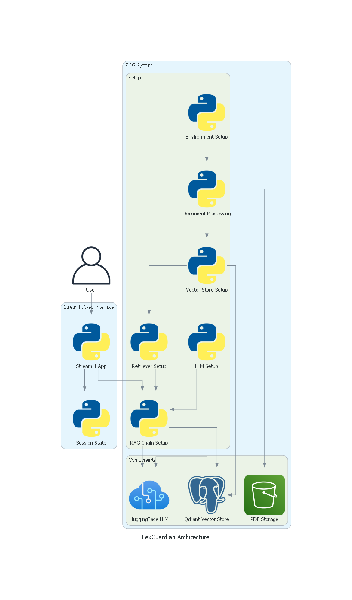

# LexGuardian


A chatbot that helps you chat with the Kenyan Law in a simple way.

## Project Organization


```
LexGuardian/
├── LICENSE
├── README.md
├── Makefile                                    # Makefile with commands like `make data` or `make train`
├── configs                                     # Config files (models and training hyperparameters)
│   └── configs.yaml
│
├── data                                        # The final, canonical data sets for modeling.
│   └── raw                                     # The original, immutable data dump.
├── artifacts
│   └── lexguardian_architecture.png
├── notebooks                                   # Jupyter notebooks.
├── app.py                                      # The streamlit app
├── pyproject.toml                              # The requirements file for reproducing the analysis environment.
└── lex_guardian                                # Source code for use in this project.
    ├── __init__.py                             # Makes src a Python module.
    ├── rag.py                                  # Containes the RAG code
    ├── utils.py                                # Contains utility code
```

## How it works


1. A user submits a question about Kenyan law through the Streamlit interface.
2. The question is processed by the RAG system:
   - The retriever finds relevant information from the vector store.
   - The RAG chain combines this information with the capabilities of the language model.
3. A response is generated, simplified for easy understanding.
4. The response is streamed back to the user through the Streamlit interface.
